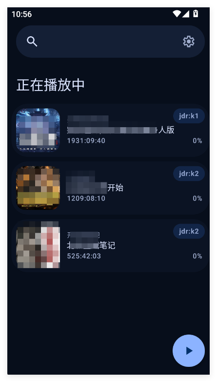
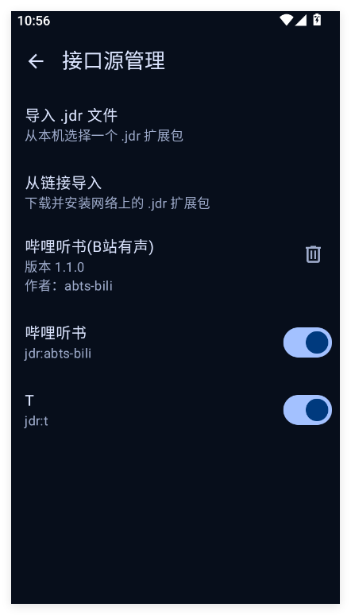

<div align="center">


# Timbre · 听书

**本地书 + WebDAV + 在线书源 + 自定义接口源，一部为中文有声书优化的 Android 播放器**

[](https://github.com/cq10086123/Timbre/releases/latest)
[](LICENSE.md)

</div>

<p align="center">
  
  
  
</p>

## 🧩 接口源一键导入

不想自己打包？直接导入现成的接口源合集（哔哩听书 等），导入即用：

**[⬇️ 下载接口源合集 Timbre.jdr](https://github.com/cq10086123/Timbre/blob/main/samples/Timbre.jdr)**

**在 App 内导入**：`设置 → 接口源 → 从链接导入`，粘贴下面这条直链即可（代码块右上角有一键复制按钮）：

```
https://raw.githubusercontent.com/cq10086123/Timbre/refs/heads/main/samples/Timbre.jdr
```

> 也可以点上方下载链接进入文件页手动下载 `.jdr`，再用「导入 .jdr 文件」选择它。

> ⚠️ **注意**：部分接口源有请求限制，请勿频繁切换；部分接口支持缓存，因接口而异。

> 🙌 **欢迎制作并分享你的接口源**：[点此一键填写分享](https://github.com/cq10086123/Timbre/issues/new?template=1-source-share.yml) · [看看大家分享的接口](https://github.com/cq10086123/Timbre/issues?q=label%3A%22source-share%22)

---

## 🎧 多种书源，一处书架

Timbre 把「本地文件、NAS、在线源、自定义接口」统合成一个书架，换源不换体验。

### 📁 本地文件
- 支持 **M4B / MP3 / M4A / OGG / OPUS / FLAC / WAV / MKV / WebM / 3GP** 等主流格式
- 自然排序：第 2 集永远排在第 10 集前面，中文数字、全角数字都能认
- 千集大书边导入边听，解析完第一集就能开始播放

### ☁️ WebDAV / NAS
- 添加服务器（HTTP/HTTPS，Basic / Digest 认证），目录树直接浏览导入
- 远程封面自动识别：`cover.jpg / artwork.png` 优先于音频内嵌图
- 导入即出封面：章节还在解析，书架封面已经挂上
- 播放边缓存、章节自动预取、WLAN 下自动刷新书库
- 断点续播、跳过片头片尾、进度记忆对远程书和本地书一样生效

### 🌐 在线书源
- 搜索即听：在线搜索有声书，直接加入书架播放
- 第三方源站直链直接播放，新增书源自动适配
- 章节时长自动探测，无信息时也不影响播放
- 播放成功后后台预热后续章节，切集更顺滑
- 错误透传：服务端失败原因直接告诉用户，不再“加载环转 90 秒”

### 🧩 自定义接口源（.jdr 扩展）

- **懒人直达**：[下载现成接口源合集](https://github.com/cq10086123/Timbre/blob/main/samples/Timbre.jdr)，或在首页复制直链后从 App 内「从链接导入」
- 想听的书源不在列表里？导入 `.jdr` 接口源包，**搜索 / 章节 / 播放直链**全部本地完成
- 脚本由播放器内置 QuickJS 沙箱在手机上执行，请求从**你自己的 IP** 直连源站，不经任何中间服务器
- 支持从文件或链接导入，一个包可封装多个接口源，按源一键启停、随时更新卸载
- 内置加密桥（MD5 / SHA / AES-ECB / AES-GCM / ChaCha20 / SM4）与 HTTP 桥，签名类、加密类接口都能写
- 想自己写接口源？[samples 开发套件](samples/README.md) 提供模板、开发指南与打包脚本，三步打包出一个 .jdr

## 💡 使用小贴士（第一次用先看这里）

很多实用功能藏在细节里，不知道就错过了：

- **封面自动就位**：本地导入的书，把任意一张封面图片放进音频文件夹，就会自动成为书籍封面（多张随机选一张）；一张图都没有时，会按书名自动生成一张。WebDAV 同样支持：文件夹里的 `cover.jpg / artwork.png` 优先于音频内嵌图
- **长按书架上的书籍**，菜单比你看到的多：
  - 在线书籍可以 **更新章节**（追更时拉取最新集数）、**缓存全书**（提前离线下载，地铁隧道不断听）
  - **删除**书籍（在线书只删记录，不碰源站）
  - 还有改书名、从文件换封面、标记"未开始 / 在听 / 听完"
- **在线章节的时长**：源站不提供时长数据时，列表会先显示 30 分钟占位，播放后自动探测真实时长并修正，无需手动干预
- **接口源导入**：首次引导页和书架添加页都能导入 `.jdr` 接口源包（本地文件或在线链接均可）

## 🎯 真正为「听书」设计

市面上的播放器大多是“音乐播放器顺便能放长音频”，Timbre 是反过来的：

- **跳过片头片尾**：每本书独立设置。片头每集只跳一次，暂停回退不打架；最后一集正常播完，不会被“跳没了”
- **断点续播**：每一本书、每一集、每一秒都记得，下次打开接着听
- **暂停自动回退**：恢复播放时往回退几秒，帮你接上上下文
- **睡眠定时器**：渐弱淡出 / 章节结束停止 / 摇一摇续命 / 定时自动开启
- **倍速、跳过静音、音量增益、章节导航、书签、Android Auto、桌面小部件、蓝牙耳机控制**

## 📚 为千集大书库而生

- **自然排序**：第 2 集永远排在第 10 集前面
- **井井有条**：正在听 / 未开始 / 已完成 自动分组，网格 / 列表切换，全局搜索
- **在线搜索**：按书名直接搜索在线源，结果一键入库
- **导入不挡播放**：播放线程优先，边导入边听也能秒切章节

## 🔒 零隐私顾虑

- 无账号、无广告、无统计、无追踪 SDK
- 书库、进度、书签、缓存全部留在你自己的设备上
- 联网行为只用于：连接你自己的 NAS / 在线书源 / 你导入的接口源，以及你**主动**搜索封面
- 详见 [隐私政策 PRIVACY.md](PRIVACY.md)

## 🎨 与系统浑然一体

全量简体中文 · Material You 动态取色 · 深色 / 浅色 / 跟随系统主题

## 📥 下载 | Download

前往 [GitHub Releases](https://github.com/cq10086123/Timbre/releases/latest) 下载最新签名 APK，
应用内也会自动提示更新。

## 🛠️ 自行编译 | Build from source

```bash
# Debug 版本（直接可装，无需签名）
./gradlew assembleFreeDebug
```

Release 签名构建、包名覆盖等说明见 [CONTRIBUTING.md](CONTRIBUTING.md)。
编译产物为 free 分支：无 Firebase、无统计、零云端依赖。

## 🤝 反馈 | Feedback

问题与建议请到 [GitHub Issues](https://github.com/cq10086123/Timbre/issues)，
常见问题见 [docs/faq.md](docs/faq.md)。

## 📄 许可与致谢 | License

Timbre 基于 [Voice](https://github.com/PaulWoitaschek/Voice)（GPLv3）二次开发，
感谢原作者 [Paul Woitaschek](https://github.com/PaulWoitaschek) 与所有上游贡献者。

[GNU GPLv3](LICENSE.md) © Voice 原作者及 Timbre 贡献者
